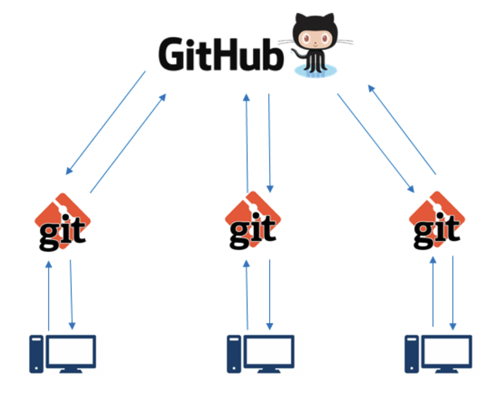

```{r setup, include=FALSE}
library('knitr')
librarian::shelf(tidyverse, ggbrookings, palmerpenguins, magick)
old.hooks <- fansi::set_knit_hooks(knitr::knit_hooks)
options(
  htmltools.dir.version = FALSE,
  htmltools.preserve.raw = FALSE,
  tibble.width = 60,
  tibble.print_min = 6,
  crayon.enabled = TRUE
)
opts_chunk$set(
  echo = TRUE,
  warning = FALSE,
  message = FALSE,
  comment = "#>",
  fig.path = 'figure/',
  cache.path = 'cache/',
  cache = TRUE,
  fig.retina = 3,
  fig.align = 'center',
  fig.show = 'hold',
  dpi = 120,
  eval = FALSE
)
```

```{r xaringan-themer, include=FALSE, warning=FALSE}
library(xaringanthemer)
style_duo_accent(
  primary_color = "#003A79",
  secondary_color = "#003a79",
  inverse_header_color = "#FAFAFA"
)
xaringanExtra::use_tile_view()
xaringanExtra::use_share_again()
xaringanExtra::use_panelset()


xaringanExtra::use_tachyons()
xaringanExtra::use_clipboard()
xaringanExtra::use_fit_screen()
xaringanExtra::use_extra_styles(
  hover_code_line = TRUE,
  mute_unhighlighted_code = TRUE
)
```

# What is Git/GitHub?


---

# Has this ever happened to you?
```{r, eval=TRUE, echo = FALSE, out.height = '550px', out.width='550px'}
knitr::include_graphics('images/what-is-version-control.gif')
```


???
ou know that great paper you just wrote, you were done with it, so you called it “final”. And then, you sent it to your advisor for her last comments. So you renamed it “final_thisone”. A few days passed, and you realized there was a typo in your figure, and you renamed it “final_thisone_really”. A couple of weeks pass, you get comments back from the reviewer, you start changing it and you renamed your file “final_submitted”. And then… your advisor think you should rewrite the conclusion and the file become “final_submitted_really”.

A year pass, you are mentoring a new undergrad in the lab, and she asks you for your final document so she can look at your methods… You open your folder, and mesmerized by the number of final labelled final, you forget which one if the correct one. Sounds familiar?

---

# Enter Git/GitHub 

+ Git and GitHub allow for easy management and sharing of data analytic content

```{r, eval=TRUE, echo = FALSE, out.height = '450px', out.width='500px'}

```

---

#Ok so what is Git/GitHub?

+ Just software!
 > Git is an application that runs on your computer, like a web brower or a word processor  - [Tom Stuart](https://r-pkgs.org/index.html)
+ GitHub is also a collaboration tool and an ecosystem of version controlled projects (repositories)


---

# Sure, but how are Git/GitHub related?

.pull-left[
+ Git is the command line software that handles version control on your repository
+ When you use GitHub, Git is always doing its things behind the scenes
]

.pull-right[
+ GitHub is a service that hosts your repository online and helps you work with collaborators
+ It's a web interface for version control 
+ Most often you will interface with GitHub with the command line, GitHub Desktop App, or RStudio.
```{r, eval=TRUE, echo = FALSE, out.height = '250px', out.width='250px'}
knitr::include_graphics('images/github-interface.png')
```


]
---
# What is Version Control?


> Git is an application that runs on your computer, like a web brower or a word processor  
> - [Tom Stuart](https://r-pkgs.org/index.html)

--

It lets you:
+ Keep the entire history of a file and inspect a file throughout its life time
--

+ Tag particular version so you can go back to them easily

--
+ Collaborate easily and make contributions transparent

--
+ Experiment with code and feature without breaking the main project

---
# What is Git?

Git is a particular implementation of version control. It’s really powerful and has many features but we will only scratch the surface.

---

# Git basics 

- Repository: 
Git manages the evolution of a set of files – called a repository or repo – in a highly structured way. 

When you start a Git project on your computer, you are going to store the entire history of the project locally. The storage of your project and its history is called a repository

However, the great advantage of using version control such as Git is to be able to collaborate with other people

---
# What is GitHub?

GitHub is a commercial website that lets you store your repository publicly for free (you need to pay if you want to keep them private, you can also get an educative account with an .edu email address that will give you some free private accounts). There are other website that offer similar services including BitBucket. Storing your repositories on these website has many advantages. It offers a friendly interface to many common operations so that you don’t have to remember how to do them at the command line. They also provide other useful features including an “Issue tracker” and wikis.

---
# Git Workflow

The typical workflow goes like this: - you create/edit/modify a file inside your repository - you stage the changes to the staging area - you commit these changes which creates a permanent snapshot of the file in the Git directory along with a message that indicates what you did to the file.

When you start a new project, the files in your working directory are untracked, you will first need to add them to your repository before Git can keep track of them and their history.

At this stage, everything is still on your hard drive. To upload your modifications (i.e., your commits) to GitHub you need to push to it.

If you are working with other people you are also committing your shared repository on GitHub, you will need to pull to bring their modifications into your local copy of the repository.
