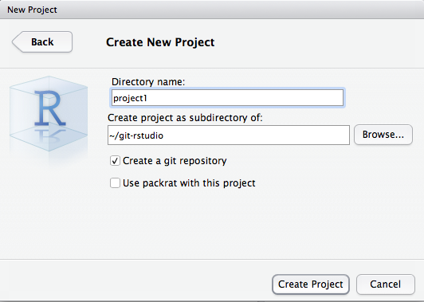

```{r setup, include=FALSE}
library('knitr')
librarian::shelf(tidyverse, ggbrookings, palmerpenguins, magick)
old.hooks <- fansi::set_knit_hooks(knitr::knit_hooks)
options(
  htmltools.dir.version = FALSE,
  htmltools.preserve.raw = FALSE,
  tibble.width = 60,
  tibble.print_min = 6,
  crayon.enabled = TRUE
)
opts_chunk$set(
  echo = TRUE,
  warning = FALSE,
  message = FALSE,
  comment = "#>",
  fig.path = 'figure/',
  cache.path = 'cache/',
  cache = TRUE,
  fig.retina = 3,
  fig.align = 'center',
  fig.show = 'hold',
  dpi = 120,
  eval = FALSE
)
```

```{r xaringan-themer, include=FALSE, warning=FALSE}
library(xaringanthemer)
style_duo_accent(
  primary_color = "#003A79",
  secondary_color = "#003a79",
  inverse_header_color = "#FAFAFA"
)
xaringanExtra::use_tile_view()
xaringanExtra::use_share_again()
xaringanExtra::use_panelset()


xaringanExtra::use_tachyons()
xaringanExtra::use_clipboard()
xaringanExtra::use_fit_screen()
xaringanExtra::use_extra_styles(
  hover_code_line = TRUE,
  mute_unhighlighted_code = TRUE
)
```


# Has this ever happened to you?
```{r, eval=TRUE, echo = FALSE, out.height = '550px', out.width='550px'}
knitr::include_graphics('imgs/what-is-version-control.gif')
```


???
ou know that great paper you just wrote, you were done with it, so you called it “final”. And then, you sent it to your advisor for her last comments. So you renamed it “final_thisone”. A few days passed, and you realized there was a typo in your figure, and you renamed it “final_thisone_really”. A couple of weeks pass, you get comments back from the reviewer, you start changing it and you renamed your file “final_submitted”. And then… your advisor think you should rewrite the conclusion and the file become “final_submitted_really”.

A year pass, you are mentoring a new undergrad in the lab, and she asks you for your final document so she can look at your methods… You open your folder, and mesmerized by the number of final labelled final, you forget which one if the correct one. Sounds familiar?

---

# Enter Git/GitHub 

+ Git and GitHub allow for easy management and sharing of data analytic content

```{r, eval=TRUE, echo = FALSE, out.height = '450px', out.width='500px'}
knitr::include_graphics('imgs/git-management.png')
```

---

#Ok, so what is Git/GitHub? 

+ Just software!
 > Git is an application that runs on your computer, like a web brower or a word processor  - [Tom Stuart](https://r-pkgs.org/index.html)
 
--

+ GitHub is also a collaboration tool and an ecosystem of version controlled projects (repositories)


---

# Sure, but how are Git/GitHub related?


.pull-left[
```{r, eval=TRUE, echo = FALSE, out.height = '200px', out.width='350px'}
knitr::include_graphics('imgs/git-logo.png')
```

+ Git is the command line software that handles version control on your repository
+ When you use GitHub, Git is always doing its things behind the scenes

]

.pull-right[
```{r, eval=TRUE, echo = FALSE, out.height = '200px'}
knitr::include_graphics('imgs/github-logo.png')
```

+ GitHub is a service that hosts your repository online and helps you work with collaborators
+ It's a web interface for version control 
+ Most often you will interface with GitHub with the command line, GitHub Desktop App, or RStudio.
]

---

class: center, middle, inverse, title-slide-ggbrookings
# Terms you should know 

---

# Version control

+ A system for tracking changes (or versions) of anything (document, file, image, etc) 

--
+ Version control allows you to **time-travel**

???
Unsure about this slide


---

# Repository (Repo)

+ This is where all your project files live

--
+ You can use Git to take snapshots (version control) of all the files in a folder

--
+ With GitHub your repo con live on your computer and on the web

```{r, eval=TRUE, echo = FALSE, out.height='400px'}

```

---

# Repository (Repo)
.pull-left[
+ It's really easy to create one from GitHub 
+ Clicking on your repositories > New will take you to a screen with some options for how to initialize your repository 
]

.pull-right[
```{r, eval=TRUE, echo = FALSE}
knitr::include_graphics('imgs/create-repo.png')
```
]
---

# Remote

.pull-left[
+ You should always back up your work, ideally somewhere different than your local drive. In _Git_, this place is called the __remote repository__
+ _GitHub_ is just a very popular __remote__
+ Some alternative remotes are:
  + [Bitbucket](https://bitbucket.org)
  + [GitLab](https://about.gitlab.com)
]

.pull-right[
```{r, eval=TRUE, echo = FALSE}
knitr::include_graphics('imgs/remotes.png')
```
]

 
---

# Cloning

+ To get some work from a remote for the first time you need to __clone__ it!
```{r, eval=TRUE, echo = FALSE}

```


---
# Git Areas
.pull-left[
+ There are three core areas to git. These are the:
  + Working Tree
  + Staging Area (also known as Index)
  + Local Repository. 
+ When working in a git repository files and modifications will travel from the Working Tree to the Staging Area and finish at the Local Repository. 
]

.pull-right[
```{r, eval=TRUE, echo = FALSE}
knitr::include_graphics('imgs/git-areas.png')
```
]
---

# The Working Tree

+ This is the area where you are currently working. 

--
+ Also known as the “__untracked__” area of git. 

--
+ Here if you make changes and do not explicitly save them to git, you will lose the changes made to your files. 

--
+ This loss of changes occurs because git is not aware of the files or changes in the __Working Tree__ until you tell it to pay attention to them.

--
+ If you make changes to files in your working tree git will recognize that they are modified, but until you tell git “Hey pay attention to these files,” it won’t save anything that goes on in them.
---

# Staging Area

+ The Staging Area is when git starts tracking and saving changes that occur in files. 
+ You tell git that I want to track these specific files, then git says okay and moves them from you Working Tree to the Staging Area and says “Cool, I know about this file in its entirety.” 
+ However, if you make any more additional changes after adding a file to the Staging Area, git will not know about those specific changes until you tell it to see them. You explicitly have to tell git to notice the edits in your files.

> When we stage a particular file we say we're __adding__ it to the __staging area__ because the command to do so is `git add 'filename'`

---

# Local Repository

+ The area that saves everything 

--
+ That's it...

--
+ We can add our staged changes to the __local repository__ by __committing__ them. 
---

# Commits

+ When you want to take a snapshot of a file or files, you create a **commit**

--
+ A commit is equivalent to saving a version of a file(s)

--
+ Git allows you to **tell the story of your project** by tracking changes through commit messages.

--
+ Every time you make a commit, you are leaving a breadcrumb of those files to come back to

```{r, eval=TRUE, echo = FALSE, out.height = '300px'}
knitr::include_graphics('imgs/commits-iris.png')
```


---

class: center, middle, inverse, title-slide-ggbrookings
# Collaborating with Git/GitHub

---
# You'll never _work_ alone 

+ As the __owner__ of a repo you can:
  + Add collaborators

--
  + Each collaborator can __read/write files__ in the repo, create __branches__, and __merge__ changes directly
  
  
```{r, eval=TRUE, echo = FALSE, out.height = '300px'}
knitr::include_graphics('imgs/contributors.png')
```

---

# Getting everyone on the same page

.pull-left[
+ You can **fetch** changes to the repo on GitHub (the **remote repository**) to see if any modified files are not on your computer
+ If you want those changes to take effect on your computer you can **pull** them from the remote repository on GitHub
+ If *you* make a commit that you want others to pull, then you need to *push* it to the remote repository
]
.pull-right[

```{r, eval=TRUE, echo = FALSE}
knitr::include_graphics('imgs/fetch-v-pull.jpeg')
```

]

---

# But what about me???

+ If you want others to see the changes *you've* made, you can **push** those commits to GitHub.
```{r, eval=TRUE, echo = FALSE, out.height = '300px'}
knitr::include_graphics('imgs/collaboration.png')
```

---

# Forking & Pull Requests

.pull-left[
+ It would be scary if anyone could _make_ changes to your project files
+ However, anyone can __*suggest*__ changes 
+ __Forking__ allows you to work on a _copy_ of a repo you're not an official contributor to
+ Once you're done with your __suggested__ changes you can make a __pull request__
+ The owner of the repo will determine if your changes are cool and __merge__ them in
+ __Pull requests__ allow you to collaborate on all public projects on GitHub
]


.pull-right[
```{r, eval=TRUE, echo = FALSE }
knitr::include_graphics('imgs/pull-request.png')
```
]

---

# Issues

+ You can also submit issues if you’re having trouble with software

```{r, eval=TRUE, echo = FALSE }

```

---
# Help me help you

+ If you use __`{ggbrookings}`__ and are having trouble or if you've found a bug, please submit an issue

--
+ If you have a question or are running into a problem, it's likely other people are too. 

--
+ Posting an issue gives me an opportunity to respond to these issues in a public forum that others can benefit from too!


---

class: center, middle, inverse, title-slide-ggbrookings
# Git and GitHub let you experiment

---
# Parallel Universes
+ Everything we've covered so far has been very linear

--
+ This is usually not how research work, often you want to experiment with easily discardable changes

--
+ You can do this in Git with __branches__

--
+ You can use __branches__ when working as a team or on a new feature


```{r, eval=TRUE, echo = FALSE, out.height = '350px'}

```


---
# Parallel Universes
.pull-left[
+ The default branch is called the __master__ branch
]
.pull-left[

```{r, eval=TRUE, echo = FALSE, out.height = '400px'}
knitr::include_graphics('imgs/master-branch.png')
```

]

---
# Parallel Universes
.pull-left[
+ The default branch is called the __master__ branch
+ You can add your own branches too
]
.pull-left[
<br><br>
```{r, eval=TRUE, echo = FALSE}
knitr::include_graphics('imgs/feature-branch.png')
```

]

---
# Parallel Universes
.pull-left[
+ The default branch is called the __master__ branch
+ You can add your own branches too
+ You'll often do a lot of work on a branch
]
.pull-left[
<br><br><br><br>
```{r, eval=TRUE, echo = FALSE}
knitr::include_graphics('imgs/wild-experiment-branch.png')
```
]
---

class: center, middle, inverse, title-slide-ggbrookings

## Branches are useful for trying out stuff since they're really easy to throw away if you decide against your changes

---

class: center, middle, inverse, title-slide-ggbrookings

## It's common for the master branch to be what you have published or finalized whereas other branches can contain work in progress

---

# Merging your changes  

.pull-left[
+ Once you finish your work on a branch, you'll want to get it back into the master branch
+ To get changes from one branch into another, you __merge__ them
+ __Merges__ help manage combining your work with someone else's
]


.pull-right[

```{r, eval=TRUE, echo = FALSE}
knitr::include_graphics('imgs/merge.png')
```
]

---

class: center, middle, inverse, title-slide-ggbrookings
# Integrating Git/GitHub with R

---


# Happy Git with R

+ You can choose from several options when using Git/GitHub:

--
  + Command-line (Terminal)
  
--
  + GitHub Desktop App (Available from the Software Center)
  
--
  + RStudio
--

+ Since I do most of my work in `R`, I'd rather not have to open a new program just to use Git.

--
+ You can use:
  + The RStudio git pane for a point and click
--

  + Packages to facilate git workflows. I highly recommend __{`gert`}__ and __{`usethis`}__
  
---

# Happy Git with R

.pull-left[
+ If you want to use the RStudio interface to control Git, you need to create an __RStudio Project__
+ Create a new RStudio Project from the upper-right corner of the RStudio IDE window, choosing _New Project_
]

.pull-right[
```{r, eval=TRUE, echo = FALSE}
knitr::include_graphics('imgs/new-project.png')
```
]

---

# Happy Git with R

.pull-left[
+ If you want to use the RStudio interface to control Git, you need to create an __RStudio Project__
+ Create a new RStudio Project from the upper-right corner of the RStudio IDE window, choosing _New Project_
+ Choose _Empty Project_
]

.pull-right[
```{r, eval=TRUE, echo = FALSE}

```
]

---

# Happy Git with R

.pull-left[
+ If you want to use the RStudio interface to control Git, you need to create an __RStudio Project__
+ Create a new RStudio Project from the upper-right corner of the RStudio IDE window, choosing _New Project_
+ Choose _Empty Project_
+ Check the option _Create a git repository_ before clicking _Create Project_
]

.pull-right[
```{r, eval=TRUE, echo = FALSE}

```
]

Congratulations, you have a new project with git versioning enabled!!


---

# Wait what about my old projects? 

.pull-left[
+ It's not too late to set up git on your existing projects!!
+ Again, create a project but this time choose _Existing Directory_
]

.pull-right[
```{r, eval=TRUE, echo = FALSE}
knitr::include_graphics('imgs/existing-directory.png')
```
]

---

# Wait what about my old projects? 

.pull-left[
+ It's not too late to set up git on your existing projects!!
+ Again, create a project but this time choose _Existing Directory_
+ Go to the _Tools menu_ -> _Version Control_ -> _Project Setup_…
]

.pull-right[
```{r, eval=TRUE, echo = FALSE}
knitr::include_graphics('imgs/project-setup.png')
```
]

---

# Wait what about my old projects? 

.pull-left[
+ It's not too late to set up git on your existing projects!!
+ Again, create a project but this time choose _Existing Directory_
+ Go to the _Tools menu_ -> _Version Control_ -> _Project Setup_…
+ This will open a new window. Change the _None_ setting by choosing _Git_ from the drop-down menu
]

.pull-right[
```{r, eval=TRUE, echo = FALSE}
knitr::include_graphics('imgs/choose-git.png')
```
]

---

#  Git Pane

.pull-left[
+ Now that you have enabled git versioning for your Project, a “Git” tab should have been added to your interface next to “Environment” and “History” tabs
+ Note that the __.gitignore file__ is automatically generated by RStudio. It lists all file formats you do _not_ want to track. 
+ You can edit this document to add any type of file you would like git not to track. One quick way of editing it is with `usethis::edit_git_ignore(scope = 'project')`
]

.pull-right[
```{r, eval=TRUE, echo = FALSE}
knitr::include_graphics('imgs/git-pane.png')
```
]

---

# Using Git from RStudio

.pull-left[
+ You can:
  + Stage files
]

.pull-right[
```{r, eval=TRUE, echo = FALSE}
knitr::include_graphics('imgs/staging.png')
```
]

---

# Using Git from RStudio

.pull-left[
+ You can:
  + Stage files
  + Commit them
]

.pull-right[
```{r, eval=TRUE, echo = FALSE}
knitr::include_graphics('imgs/commiting.png')
```
]
---

# Using Git from RStudio

.pull-left[
+ You can:
  + Stage files
  + Commit them
  + Push/Pull
]

.pull-right[
```{r, eval=TRUE, echo = FALSE}
knitr::include_graphics('imgs/commiting.png')
```
]

---

# Using Git from RStudio

.pull-left[
+ You can:
  + Stage files
  + Commit them
  + Push/Pull
  + Revert your changes
]

.pull-right[
```{r, eval=TRUE, echo = FALSE}

```
]


---

# Using Git from RStudio

.pull-left[
+ You can:
  + Stage files
  + Commit them
  + Push/Pull
  + Revert your changes
  + View your repo's commit history
]

.pull-right[
```{r, eval=TRUE, echo = FALSE}

```
]

---

# Using Git with R

.pull-left[
```{r}
library(gert)
git_status()
```

]

.pull-right[
```{r, eval=TRUE, echo=FALSE}
git_status()
```

]
