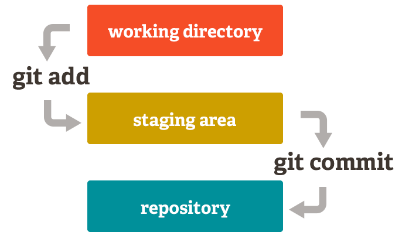
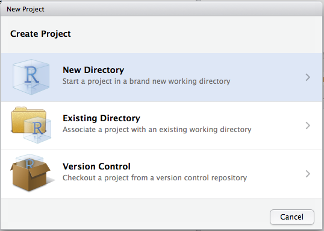
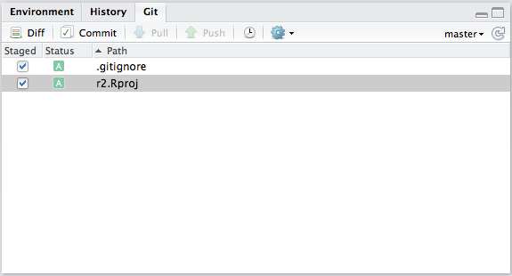

```{r setup, include=FALSE}
library('knitr')
librarian::shelf(tidyverse, ggbrookings, palmerpenguins, magick)
old.hooks <- fansi::set_knit_hooks(knitr::knit_hooks)
options(
  htmltools.dir.version = FALSE,
  htmltools.preserve.raw = FALSE,
  tibble.width = 60,
  tibble.print_min = 6,
  crayon.enabled = TRUE
)
opts_chunk$set(
  echo = TRUE,
  warning = FALSE,
  message = FALSE,
  comment = "#>",
  cache.path = 'cache/',
  fig.path = 'figure/',
  fig.retina = 3,
  fig.align = 'center',
  fig.show = 'hold',
  dpi = 120,
  eval = FALSE
)
```

```{r xaringan-themer, include=FALSE, warning=FALSE, eval=TRUE}
library(xaringanthemer)
style_duo_accent(
  primary_color = "#003A79",
  secondary_color = "#003a79",
  inverse_header_color = "#FAFAFA"
)
xaringanExtra::use_tile_view()
xaringanExtra::use_share_again()
xaringanExtra::use_panelset()


xaringanExtra::use_tachyons()
xaringanExtra::use_clipboard()
xaringanExtra::use_fit_screen()
xaringanExtra::use_extra_styles(
  hover_code_line = TRUE,
  mute_unhighlighted_code = TRUE
)
xaringanExtra::use_fit_screen()
```

```{css echo=FALSE, eval = TRUE}
.highlight-last-item > ul > li, 
.highlight-last-item > ol > li {
  opacity: 0.5;
}
.highlight-last-item > ul > li:last-of-type,
.highlight-last-item > ol > li:last-of-type {
  opacity: 1;
}
```


.left-column[
# Has this ever happened to you?
]

.right-column[
```{r, eval=TRUE, echo = FALSE, out.height = '550px', out.width='550px'}
knitr::include_graphics('imgs/what-is-version-control.gif')
```
]

???
You know that great paper you just wrote, you were done with it, so you called it “final”. And then, you sent it to your advisor for her last comments. So you renamed it “final_thisone”. A few days passed, and you realized there was a typo in your figure, and you renamed it “final_thisone_really”. A couple of weeks pass, you get comments back from the reviewer, you start changing it and you renamed your file “final_submitted”. And then… your advisor think you should rewrite the conclusion and the file become “final_submitted_really”.

A year pass, you are mentoring a new undergrad in the lab, and she asks you for your final document so she can look at your methods… You open your folder, and mesmerized by the number of final labelled final, you forget which one if the correct one. Sounds familiar?
---

# Then Git & GitHub are for you

#### .large[__Git__ and __GitHub__ allow for easy management and sharing of data analytic content]

```{r, eval=TRUE, echo = FALSE, out.height = '450px', out.width='500px'}
knitr::include_graphics('imgs/git-management.png')
```

---

#So what is Git? 


.bg-washed-green.b--dark-green.ba.bw2.br3.shadow-5.ph4.mt5[
Git is a __version control system__. Its original purpose was to help groups of developers work collaboratively on big software projects. Git manages the evolution of a set of files – called a __repository__ or repo – in a sane, highly structured way. 

It is like the “Track Changes” feature from Microsoft Word, but more rigorous, powerful, and scaled up to multiple files.

.tr[
— Jennifer Bryan, [_Excuse me, do you have a moment to talk about version control?_](https://peerj.com/preprints/3159v2/)
]]


---
# Wait so how is Git different than GitHub?

.pull-left[
```{r, eval=TRUE, echo = FALSE, out.height = '200px', out.width='350px'}

```
+ __Git__ is the software you will use __locally__ to record changes to a set of files. 
+ When you use __GitHub__, __Git__ is always doing its things behind the scenes
]

--

.pull-right[
```{r, eval=TRUE, echo = FALSE, out.height = '200px'}

```
+ __GitHub__ is a __hosting service__ that provides a Git-aware home for such projects on the internet. 
+ __GitHub__ is like DropBox or Google Drive, but more structured, powerful, and programmatic.

]

---

class: center, middle, inverse, title-slide-ggbrookings
# Let's Git Started: Key Concepts


---

# Repository (Repo)

+ This is where all your project files live

--
+ You can use __Git__ to take snapshots (version control) of all the files in a folder

--
+ With __GitHub__ your repo con live on your computer and on the web

```{r, eval=TRUE, echo = FALSE, out.height='400px'}
knitr::include_graphics('imgs/git-brownbag-repo.png')
```

---

# Repository (Repo)
.pull-left[
+ It's really easy to create one from GitHub 
+ Clicking on _your repositories > New_ will take you to a screen with some options for how to initialize your repository 
]

--
.pull-right[
```{r, eval=TRUE, echo = FALSE}

```
]
---

# Remote

.pull-left[
+ You should always back up your work, ideally somewhere different than your local drive. In __Git__, this place is called the __remote repository__
+ __GitHub__ is just a very popular __remote__
+ Some alternative remotes are:
  + [Bitbucket](https://bitbucket.org)
  + [GitLab](https://about.gitlab.com)
]

.pull-right[
```{r, eval=TRUE, echo = FALSE}
knitr::include_graphics('imgs/remotes.png')
```
]

 
---

# Cloning

.left-column[To get some work from a __remote__ for the first time you need to __clone__ it!.

This is a fancy term for downloading a local copy of the repo]

.right-column[
```{r, eval=TRUE, echo = FALSE}
knitr::include_graphics('imgs/cloning.png')
```
]


---
# Git Areas
.pull-left[
+ Once we start making changes to the __repo__ we __cloned__, these changes will exist in one of the three core __areas__ to Git: 
  + __Working Tree__ (a.k.a untracked area)
  + __Staging Area__ 
  + __Local Repository__
+ Files and modifications will travel from the __Working Tree__ to the __Staging Area__ and finish at the __Local Repository__. 
]

.pull-right[
```{r, eval=TRUE, echo = FALSE}

```
]
---

# The Working Tree 

+ This is the area where you are currently working. 
--

+ If you make changes to files in your __working tree__ Git will recognize that they are modified, but won't save anything that goes on in them
  + This is why some people call it the “__untracked__” area of git. 
--

+ Git will only start __tracking__ our files once we explicitly tell it to.
--


.pull-left[
You can check where your files are with:
```{r}
gert::git_status()
```
]

.pull-right[
<br>
```{r, echo=F, eval=T}
gert::git_status()
```

]

---

# Staging Area

The __Staging Area__ is where Git starts tracking and saving changes that occur in files. 

--
+ You tell __Git__ you want to track these specific files

--
+ __Git__ moves them from your __Working Tree__ to the __Staging Area__ and says “Cool, I know about this file in its entirety.” 

--
> When we stage a particular file we say we're __adding__ it to the __staging area__ because the terminal command staging is `git add 'filename'`

---

# Local Repository

+ The area that saves everything 

--
  + That's it...

--
+ Now we're ready to add our __staged changes__ to the __local repository__ by __committing__ them. 
---

# Who's Scared of Commitment?

+ When you want to take a snapshot of a file, you create a **commit**

--
+ A __commit__ is equivalent to saving a version of a file(s)

--
+ Every time you make a commit you must also write a short commit message. Ideally, this conveys the motivation for the change

--
+ Commiting frequently will save you lots of headaches


```{r, eval=TRUE, echo = FALSE, out.height = '300px'}

```
---
class: center, middle,  title-slide-ggbrookings

## Everything we've covered so far has been very linear

---
class: center, middle,  title-slide-ggbrookings

## In research projects you often want to experiment with easily discardable changes
---
class: center, middle, inverse, title-slide-ggbrookings
# Branching Out and Trying New Things

---
# Branching Out

> A __branch__ is an independent line of development within a repo, where the intent is usually to merge it into the master branch when ready

--

.large[__Branches__ are useful for trying out stuff since they're really easy to throw away if you decide against your changes]
--

.left-column[

+ You'll often use __branches__ when working as a team on a new feature for your project
]

.right-column[
```{r, eval=TRUE, echo = FALSE}
knitr::include_graphics('imgs/fim-branch.png')
```
]

---
# Branching Out
.left-column[
+ The __default__ branch is called the __master branch__ 
]
.right-column[

```{r, eval=TRUE, echo = FALSE} 
knitr::include_graphics('imgs/master-branch.png')
```

]

---
# Branching Out
.left-column[
+ The __default__ branch is called the __master branch__
+ You can add your own branches too
]
.right-column[
<br><br>
```{r, eval=TRUE, echo = FALSE}
knitr::include_graphics('imgs/feature-branch.png')
```

]

---
# Branching Out
.left-column[
+ You can add your own branches too
+ The __default__ branch is called the __master branch__
+ You'll often do a lot of work on a branch 
]
.right-column[
```{r, eval=TRUE, echo = FALSE}

```
]

---

# Merging your changes  

> It's common for the master branch to be what you have published or finalized whereas other branches can contain work in progress

.pull-left[
+ Once you finish your work on a branch, you'll want to get it back into the master branch
+ To get changes from one branch into another, you __merge__ them
+ __Merges__ help manage combining your work with someone else's
]


.pull-right[

```{r, eval=TRUE, echo = FALSE}

```
]

---

# Pull Requests and Forks

+ __Pull request__ is a GitHub-specific way to propose changes to a repo with facilities for structured review.
+ They can be made between 
  + Two __branches__ in the same repo
  + Two independent copies of a repo, an original and a so-called __“fork”__.

.large[We'll go over an example soon]
---
class: middle, center 
## So far Git’s model of file management may seem uncomfortably rigid
---
class: middle, center
## But the pros of Git outweigh the cons when you consider the overhead of working with other people, including your future self
---


class: center, middle, inverse, title-slide-ggbrookings
# Collaborating with Git & GitHub:
# You'll never _work_ alone


---

# Adding Contributors
.pull-left[
+ As the __owner__ of a repo you can:
  + Add collaborators with permission to __read/write files__ in the repo, create __branches__, and __merge__ changes directly
]

.pull-right[
  
```{r, eval=TRUE, echo = FALSE, out.height = '300px'}
knitr::include_graphics('imgs/contributors.png')
```

] 


---

# _Git_ everyone on the same page

.pull-left[
+ **Fetch** changes to the repo on GitHub (the **remote repository**) to see if any modified files are not on your computer
+ __Pull__ them from the remote repository on GitHub if you want those changes to take effect on your computer.
]
.pull-right[

```{r, eval=TRUE, echo = FALSE}
knitr::include_graphics('imgs/fetch-v-pull.jpeg')
```

]

--
.pull-left[
+ __Push__ your changes to the __remote__ if _you_ make a commit that you want others to __pull__
]

---

class: center, middle, inverse, title-slide-ggbrookings
# Integrating Git & GitHub with R

---


# What are our options?

+ You can choose from several options when using Git/GitHub:

--
  + Command-line (Terminal)
  
--
  + GitHub Desktop App (Available from the Software Center)
  
--
  + RStudio
--

+ Since I do most of my work in `R`, I'd rather not have to open a new program just to use Git.

--
+ You can use:
  + The RStudio git pane for a point and click
--

  + Packages to facilate git workflows. I highly recommend __{`gert`}__ and __{`usethis`}__
  
---

# Setting Up a New Project

.pull-left[
+ If you want to use the RStudio interface to control Git, you need to create an __RStudio Project__
+ Create a new RStudio Project from the upper-right corner of the RStudio IDE window, choosing _New Project_
]

.pull-right[
```{r, eval=TRUE, echo = FALSE}

```
]

---

# Setting Up a New Project

.pull-left[
+ If you want to use the RStudio interface to control Git, you need to create an __RStudio Project__
+ Create a new RStudio Project from the upper-right corner of the RStudio IDE window, choosing _New Project_
+ Choose _Empty Project_
]

.pull-right[
```{r, eval=TRUE, echo = FALSE}
knitr::include_graphics('imgs/empty-project.png')
```
]

---

# Setting Up a New Project

.pull-left[
+ If you want to use the RStudio interface to control Git, you need to create an __RStudio Project__
+ Create a new RStudio Project from the upper-right corner of the RStudio IDE window, choosing _New Project_
+ Choose _Empty Project_
+ Check the option _Create a git repository_ before clicking _Create Project_
]

.pull-right[
```{r, eval=TRUE, echo = FALSE}
knitr::include_graphics('imgs/create-project.png')
```
]


---

# Wait what about my old projects? 

.pull-left[
+ It's not too late to set up git on your existing projects!!
+ Again, create a project but this time choose _Existing Directory_
]

.pull-right[
```{r, eval=TRUE, echo = FALSE}
knitr::include_graphics('imgs/existing-directory.png')
```
]

---

# Wait what about my old projects? 

.pull-left[
+ It's not too late to set up git on your existing projects!!
+ Again, create a project but this time choose _Existing Directory_
+ Go to the _Tools menu_ -> _Version Control_ -> _Project Setup_…
]

.pull-right[
```{r, eval=TRUE, echo = FALSE}
knitr::include_graphics('imgs/project-setup.png')
```
]

---

# Wait what about my old projects? 

.pull-left[
+ It's not too late to set up git on your existing projects!!
+ Again, create a project but this time choose _Existing Directory_
+ Go to the _Tools menu_ -> _Version Control_ -> _Project Setup_…
+ This will open a new window. Change the _None_ setting by choosing _Git_ from the drop-down menu
]

.pull-right[
```{r, eval=TRUE, echo = FALSE}
knitr::include_graphics('imgs/choose-git.png')
```
]

--
### Congratulations, your project has Git versioning enabled!🎉🎉🎉

---

# Using Git from RStudio

.pull-left[
+ A “Git” tab should have been added to your interface next to “Environment” and “History” tabs
+ Note the __.gitignore file__ automatically generated by RStudio—it lists all file formats you do _not_ want to track. 
+ You can edit this document to add any type of file you would like git not to track. 
```{r}
usethis::edit_git_ignore(scope = 'project')
```

]

.pull-right[
```{r, eval=TRUE, echo = FALSE}

```
]

---

# Using Git from RStudio
 From the Git pane you can:
.left-column[
+ __Stage__ files
]

.right-column[
```{r, eval=TRUE, echo = FALSE}

```
]

---

# Using Git from RStudio
 From the Git pane you can:
.left-column[
+ Stage files
+ __Commit__ them
]

.right-column[
```{r, eval=TRUE, echo = FALSE}
knitr::include_graphics('imgs/commiting.png')
```
]
---

# Using Git from RStudio
 From the Git pane you can:
.left-column[
+ Stage files
+ Commit them
+ __Push/Pull__
]

.right-column[
```{r, eval=TRUE, echo = FALSE}
knitr::include_graphics('imgs/commiting.png')
```
]

---

# Using Git from RStudio
 From the Git pane you can:
.left-column[
+ Stage files
+ Commit them
+ Push/Pull
+ __Revert__ your changes
]

.right-column[
```{r, eval=TRUE, echo = FALSE}
knitr::include_graphics('imgs/revert-commit.png')
```
]


---

# Using Git from RStudio
 From the Git pane you can:
.left-column[
+ Stage files
+ Commit them
+ Push/Pull
+ Revert your changes
+ View your repo's __commit history__
]

.right-column[
```{r, eval=TRUE, echo = FALSE}
knitr::include_graphics('imgs/commit-history.png')
```
]

---

#  Git with R


.pull-left[
+ We can easily replicate the project setup we did with some nice functions from __`{usethis}`__
]

.pull-right[
```{r}
usethis::create_project('example-project')


✓ Setting active project to '/Users/malcalakovalski/example-project'
✓ Writing 'example-project.Rproj'
✓ Opening '/Users/malcalakovalski/example-project/' in new RStudio session
✓ Setting active project to '<no active project>'
```

]

---

# Using Git with R


.pull-left[
+ We can easily replicate the project setup we did with some nice functions from __`{usethis}`__
+ Next, we must make our new project a __Git repository__
]

.pull-right[
<br><br><br>
```{r}
usethis::use_git()

✓ Setting active project to '/Users/malcalakovalski/example-project'
✓ Initialising Git repo
✓ Adding '.Rhistory', '.Rdata', '.httr-oauth', '.DS_Store' to '.gitignore'
```

]

---

# Using Git with R


.pull-left[
+ We can easily replicate the project setup we did with some nice functions from __`{usethis}`__
+ Next, we must make our new project a __git repository__
+ Finally, we can create a __GitHub repository__ 
]

.pull-right[
<br><br><br>
<br><br><br>
```{r}
usethis::use_github()

✓ Setting active project to '/Users/malcalakovalski/example-project'
✓ Creating GitHub repository 'malcalakovalski/example-project'
✓ Setting remote 'origin' to 'git@github.com:malcalakovalski/example-project.git'
✓ Pushing 'master' branch to GitHub and setting 'origin/master' as upstream branch
✓ Opening URL 'https://github.com/malcalakovalski/example-project'
```


]

---
background-image: url(imgs/example-github.png)
background-size: contain
background-size: 85%, 20%

# ✅ Now people can __clone__ or __fork__ our repo!

---

# Contributing to someone else's projects

>Recall: A __pull request__ is how you propose a change to a GitHub repository. Think of it as a _request_ for the maintainer to _pull_ your changes into their repo.

--

+ We will suggest changes to the __README__ file on a toy __GitHub repo__ I creatively titled `example-repo`. 


--

+ The __README__ simpy says "Example repo" which is not very descriptive.
--

+ We will propose a slightly more informative opening sentence. 
---
# This is what the repo looks like right now

```{r, eval=T, echo=F}

```
---

# Our First Pull Request

.pull-left[
+ First, __fork__ the repository to get your own copy on GitHub, and then __clone__ that, to get your own local copy.
]

.pull-right[

```{r}
usethis::create_from_github('https://github.com/mgalcala/example-repo', fork = TRUE)

✓ Creating '/Users/malcalakovalski/Documents/Projects/example-repo/'
✓ Forking 'mgalcala/example-repo'
✓ Cloning repo from 'git@github.com:malcalakovalski/example-repo.git' into '/Users/malcalakovalski/Documents/Projects/example-repo'
✓ Setting active project to '/Users/malcalakovalski/Documents/Projects/example-repo'
ℹ Default branch is 'main'
✓ Adding 'upstream' remote: 'git@github.com:mgalcala/example-repo.git'
✓ Pulling changes from 'upstream/main'.
✓ Setting remote tracking branch for local 'main' branch to 'upstream/main'
✓ Writing 'example-repo.Rproj'
✓ Adding '.Rproj.user' to '.gitignore'
✓ Opening '/Users/malcalakovalski/Documents/Projects/example-repo/' in new RStudio session
✓ Setting active project to '<no active project>'
```
]


---

# Our First Pull Request

.pull-left[
+ First, __fork__ the repository to get your own copy on GitHub, and then __clone__ that, to get your own local copy.
+ Next start the __pull request__ with __`pr_init()`__, which creates a branch in our pull request repository and switches to it (or __"checks it out"__). 
]

.pull-right[

```{r}
pr_init(branch = 'feature-improve-readme')
```

```{r}
✓ Setting active project to '/Users/malcalakovalski/Documents/Projects/example-repo'
✓ Pulling changes from 'upstream/main'.
✓ Creating and switching to local branch 'feature-improve-readme'.
• Use `pr_push()` to create a PR.
```

]


--

### `r emo::ji('check')` Now we can work locally, make changes to files and commit hem to Git

---
# Pull Request Workflow

.left-column[
+ Change the __README__
]

.right-column[
We write "Example repo used in the Brookings Data Network Git brownbag to demonstrate the workflow of creating a pull"
]

---
# Pull Request Workflow
.left-column[
+ Change the __README__
+ See our files in the __working tree__
]

.right-column[
<br><br>
```{r}
gert::git_status()
```
```{r, echo = FALSE, eval = TRUE}
structure(list(file = c(".gitignore", "example-repo.Rproj", "README.md"
), status = c("new", "new", "modified"), staged = c(FALSE, FALSE, 
FALSE)), row.names = c(NA, -3L), class = c("tbl_df", "tbl", "data.frame"
))
```

]

---
# Pull Request Workflow
.left-column[
+ Change the __README__
+ See our files in the __working tree__
+ __Stage__ them
]

.right-column[
<br><br><br><br><br><br>
```{r}
# Stage a specific file
gert::git_add(files = 'README.md')
# Stage every file in the working tree
gert::git_add(files = '.')
```


]

---
# Pull Request Workflow
.left-column[
+ Change the __README__
+ See our files in the __working tree__
+ __Stage__ them
+ __Commit__ them 
]

.right-column[
<br><br><br><br><br><br><br><br>
```{r}
gert::git_commit(message = 'Added information on what the repository is for')
```


]

---
# Pull Request Workflow
.left-column[
+ Change the __README__
+ See our files in the __working tree__
+ __Stage__ them
+ __Commit__ them 
]

.right-column[
😎 __Tip:__ We can combine the staging and commiting steps with 
```{r}
gert::git_commit_all(message = 'your commit message') 😎
```


]


---

# Usual Git Workflow for Collaboration

+ If we had ownership over the repository, we could __push__ our changes to our collaborators with __`gert::git_push()`__
--

+ In turn, they would be able __fetch__ and then __pull__ our changes with __`gert::git_fetch()`__ and __`gert::git_pull()`__

--
+ Since we are not direct collaborators to the project, our workflow will be a little different. 

---

# Sending Over Our Suggestion 

.pull-left[
+ __Push__ the local change to our copy of _example-repo_ on GitHub using __`usethis::pr_push()`__
]

.pull-right[

```{r}
usethis::pr_push()
✓ Setting active project to '/Users/malcalakovalski/Documents/Projects/example-repo'
✓ Pushing local 'feature-improve-readme' branch to 'origin' remote.
• Create PR at link given below
✓ Opening URL 'https://github.com/malcalakovalski/example-repo/compare/feature-improve-readme'
```
This launches a browser window at the specified URL and we need to click on where it says __"Create Pull Request"__

]


---

# Sending Over Our Suggestion

.pull-left[
+ __Push__ the local change to our copy of _example-repo_ on GitHub using __`usethis::pr_push()`__
+ GitHub will ping the project owner and they will review our pull request. We can view this pull request in the browser with `usethis::pr_view()`
]

.pull-left[
```{r, echo=F, eval=T}
knitr::include_graphics('imgs/pr-push.png')
```
]

---

class: center, middle, inverse, title-slide-ggbrookings

### If our _pull request_ is perfect, the maintainer will accept it (i.e. _merge_ it). 
<br>

---
class: center, middle, inverse, title-slide-ggbrookings

### ⚠️ Alas, there was an omission in our commit: 
### Instead of writing _"pull request"_ we wrote _"pull" _

```{r, echo=F, eval= T, out.height='550px'}
knitr::include_graphics("imgs/diff.png")
```


---
background-image: url(/imgs/pr-review.png)
background-size: contain
background-position: bottom
background-size: 65%, 20%


### 🚨🚨🚨 Since our pull request had a missing word, the project owner leaves us some comments requesting changes. 


---

## Responding to our PR Review

We can then go back and complete the sentence, commit the correction, and push them back with __`usethis::pr_push()`__

```{r, echo=F, eval=T}
knitr::include_graphics('imgs/pr-response.png')
```

---

## Reviewing a Pull Request

+ Now the reviewer gets another chance to review our changes. 
+ At this point they might choose to just make the necessary changes themselves and push their commits into our pull request to finish things up.

--
+ The reviewer can fetch the pull request to their local machine with __`usethis::pr_fetch()`__

--
+ Fetching the PR creates a local branch for them called _`malcalakovalski-feature-improve-readme`_ 

--
+ Once the reviewer makes the necessary changes they run __`pr_push()`__ to push their changes into our PR

--
+ Finally, the reviewer merges our pull request on GitHub by running __`pr_finish()`__

```{r}
#> ✔ Checking that remote branch 'malcalakovalski-feature-improve-readme' has the changes in 'local/malcalakovalski-feature-improve-readme'
#> ✔ Switching back to 'master' branch
#> ✔ Pulling changes from GitHub source repo 'origin/master'
#> ✔ Deleting local 'malcalakovalski-feature-improve-readme' branch
#> ✔ Removing remote 'mine-cetinkaya-rundel'
```

---
# Pulling Reviewer Changes

+ Since the reviewer has contributed some code to our pull request, we can get that code back to our computer with __`usethis::pr_pull()`__
--

+ This feature can be useful in PRs if there are a few rounds of alternating contributions from you and the maintainer
--

+ In this case it is optional, since the full PR has already been incorporated into the default branch of the source repo. 

---
class: center, middle, inverse, title-slide-ggbrookings

#We have successfully contributed to a project! 🎉🎉🎉

---
# Shameless Plug: Help me help you

+ If you use __`{ggbrookings}`__ and are having trouble, please submit an __issue__ on GitHub
+ Posting an issue gives me an opportunity to respond to your questions in a public forum that others can benefit from too!
+ Even better, if you have a suggestion for a new feature or an improvement to the package please submit a __pull request__!

---
class: center, middle, inverse, title-slide-ggbrookings

#Thank you for your time! 🤗🤗🤗
